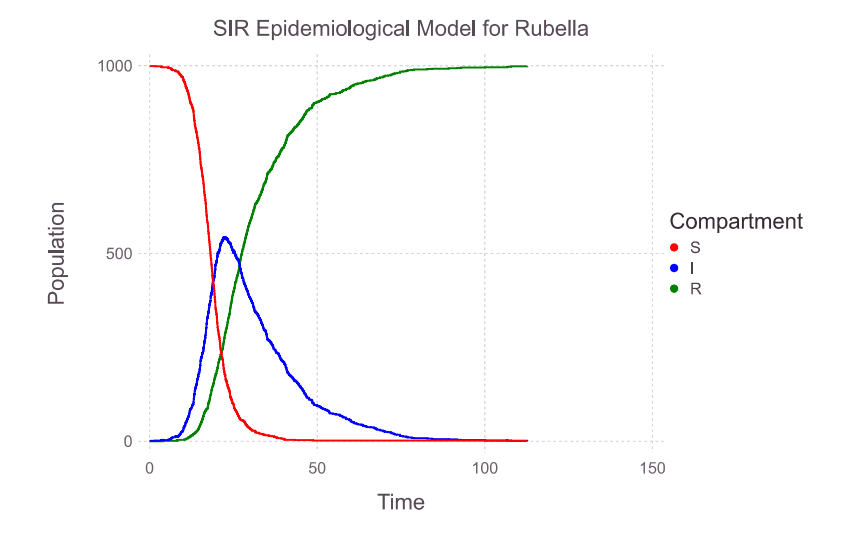
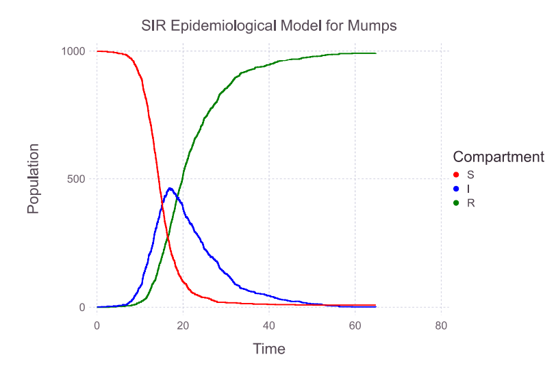

# RubellaMumps-SpreadSim
🦠 Stochastic SIR model simulation in Julia comparing the spread of Rubella and Mumps (Gondogan) using the Gillespie algorithm.

# Stochastic SIR Model Simulation for Rubella and Mumps (Gondogan)

This repository contains a stochastic SIR (Susceptible-Infected-Recovered) model simulation implemented in Julia. The model simulates and compares the spread dynamics of two infectious diseases: **Rubella** and **Mumps** (referred to as "Gondogan").

## 🧠 Overview

The SIR model is a classic compartmental model in epidemiology, dividing the population into three groups: susceptible (S), infected (I), and recovered (R). This implementation leverages the **Gillespie algorithm**, which provides a stochastic (probabilistic) approach to simulate the random nature of disease transmission and recovery events.

## 📈 Model Equations (Normalized by Total Population)

Let:

- \( S(t) \), \( I(t) \), \( R(t) \): number of susceptible, infected, and recovered individuals at time \( t \)
- \( N(t) = S(t) + I(t) + R(t) \): total population at time \( t \) (assumed constant)
- We define proportions:  
  \( s(t) = \frac{S(t)}{N} \),  
  \( i(t) = \frac{I(t)}{N} \),  
  \( r(t) = \frac{R(t)}{N} \)

### Discrete Form (Proportion-Based)
\[
\begin{aligned}
s_{t+1} &= s_t - \beta s_t i_t \\
i_{t+1} &= i_t + \beta s_t i_t - \gamma i_t \\
r_{t+1} &= r_t + \gamma i_t
\end{aligned}
\]

### Continuous Form (Proportion-Based)
\[
\begin{aligned}
\frac{ds(t)}{dt} &= -\beta s(t) i(t) \\
\frac{di(t)}{dt} &= \beta s(t) i(t) - \gamma i(t) \\
\frac{dr(t)}{dt} &= \gamma i(t)
\end{aligned}
\]

This normalized form is useful when the population size \( N \) is constant and we are primarily interested in the *proportions* of the population in each compartment.

## 🔍 Key Features

- Stochastic simulation using the **Gillespie algorithm**
- Comparative analysis of Rubella and Mumps
- Calculation of basic reproduction number (**R₀**)
- Visualization of disease dynamics over time
- Peak infection time and outbreak duration analysis

## ⚙️ Parameters

| Disease         | Infection Duration | β (Infection Rate) | γ (Recovery Rate) | R₀ Range |
|------------------|---------------------|---------------------|--------------------|-----------|
| Rubella          | 12–14 days          | ≈ 0.5               | ≈ 0.077            | 6–7       |
| Mumps (Gondogan) | ~7 days             | ≈ 0.7               | ≈ 0.143            | 4–10      |

These parameters reflect real-world epidemiological estimates and directly influence the rate of transmission and the shape of the epidemic curve.

## 📊 Results

Simulation results demonstrate key differences in the spread dynamics of Rubella and Mumps:

### Rubella
- 🕒 **Peak infection time:** Day 22  
- 📈 **Peak infections:** 554 individuals  
- 🧪 **Outbreak duration:** Ends around Day 112 (peak recovery)

### Mumps (Gondogan)
- 🕒 **Peak infection time:** Day 18  
- 📉 **Peak infections:** 446 individuals  
- 🧪 **Outbreak duration:** Ends around Day 76 (peak recovery)

These differences highlight how epidemiological parameters such as infection duration and reproduction number (**R₀**) significantly influence the transmission rate and epidemic length within a population.

## 🛠 Installation

1. **Install Julia** (version 1.11 or later recommended)
2. **Clone this repository**
3. **Install required packages** by running the following in Julia:

```julia
using Pkg
Pkg.add(url="https://github.com/sdwfrost/GiILespie.jl")
Pkg.add(["Plots", "DataFrames", "Gadfly", "Interact", "Statistics", "Random"])
```

## ▶️ Usage

Run the Julia script to perform the following:

- Define the SIR model
- Set initial conditions for Rubella and Mumps
- Execute stochastic simulations using the Gillespie algorithm
- Generate and visualize the time evolution of susceptible, infected, and recovered individuals
- Analyze peak infection statistics and outbreak duration

## 📦 Dependencies

The simulation relies on the following Julia packages:

- [`GiILespie.jl`](https://github.com/sdwfrost/GiILespie.jl) — Gillespie algorithm implementation
- `Plots`
- `DataFrames`
- `Gadfly`
- `Interact`
- `Statistics`
- `Random`

## 🖼 Output Examples

Example plots generated by the simulation:

- 
- 

These plots show the progression of S, I, and R compartments over time for each disease.

## 📜 License

This project is licensed under the **MIT License**.  
Feel free to use, modify, and distribute with attribution.

## 📚 References

- Gillespie, D.T. (1977). *Exact stochastic simulation of coupled chemical reactions*.  
- Standard literature on SIR model and infectious disease modeling.

---

Created with 💻 using Julia. Contributions are welcome!
